<div align="center">

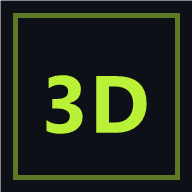

# FitMotion 3D

**3D 交互式健身动作库 —— 标准动作，360° 看清每个细节**

不再对着平面图猜角度。每个动作都是 3D 人偶实时演示：自由旋转、逐帧拆解、错误对比、跟练计时，把「练对」这件事交给眼睛。

[](https://react.dev/)
[](https://threejs.org/)
[](https://r3f.docs.pmnd.rs/)
[](https://vitejs.dev/)
[](https://www.typescriptlang.org/)
[](https://vite-pwa-org.netlify.app/)

[在线体验](https://zchuhui.github.io/fitness-3D/) · [快速开始](#-快速开始) · [动作一览](#-动作一览) · [添加新动作](#-添加--替换动作)

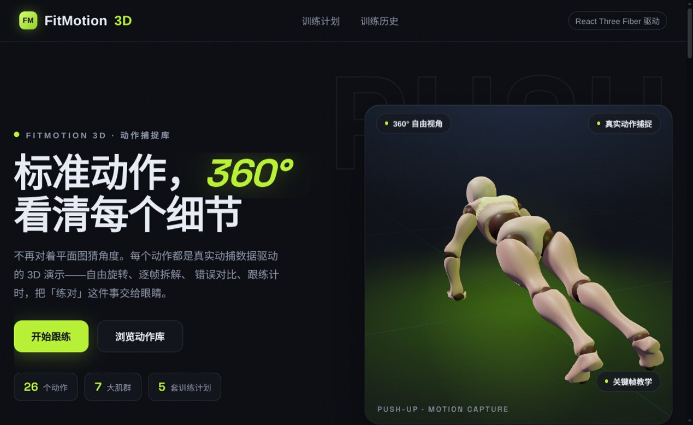

</div>

---

## ✨ 功能亮点

### 🗂 动作库：26 个动作，按肌群 / 场景筛选

覆盖胸、背、腿、肩、手臂、核心、全身 7 大肌群，另有「居家自重」和「瑜伽」两个场景筛选，支持中英文搜索（如 `深蹲` / `squat`）。

每张卡片的封面都是用同一套机位离线渲染的：人物大小一致、居中、脚踩地面光晕。鼠标悬停时，封面会无缝切换成实时 3D，从封面姿势开始播放动作并缓慢旋转。

<p align="center">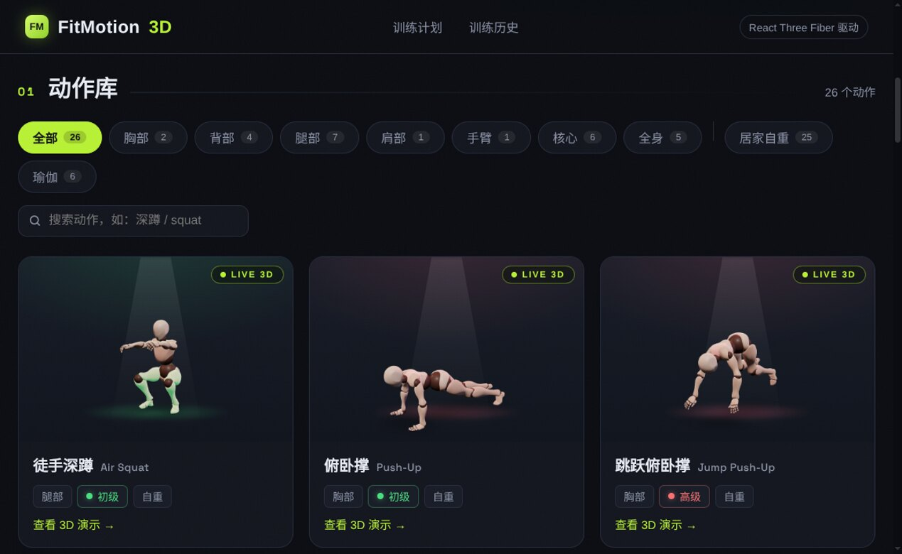</p>

### 🎥 3D 动作详情：拖拽旋转、逐帧拆解

- **自由视角**：左键旋转、滚轮缩放、右键平移，一键切换 正面 / 侧面 / 背面 / 俯视
- **时间轴与关键帧**：拖动进度条逐帧查看，0.25× ~ 2× 变速播放
- **要点联动**：点击右侧「动作要点」，3D 画面直接跳到对应关键帧
- **快捷键**：`空格` 播放 / 暂停，`←` `→` 切换关键帧，`R` 重置视角

<p align="center">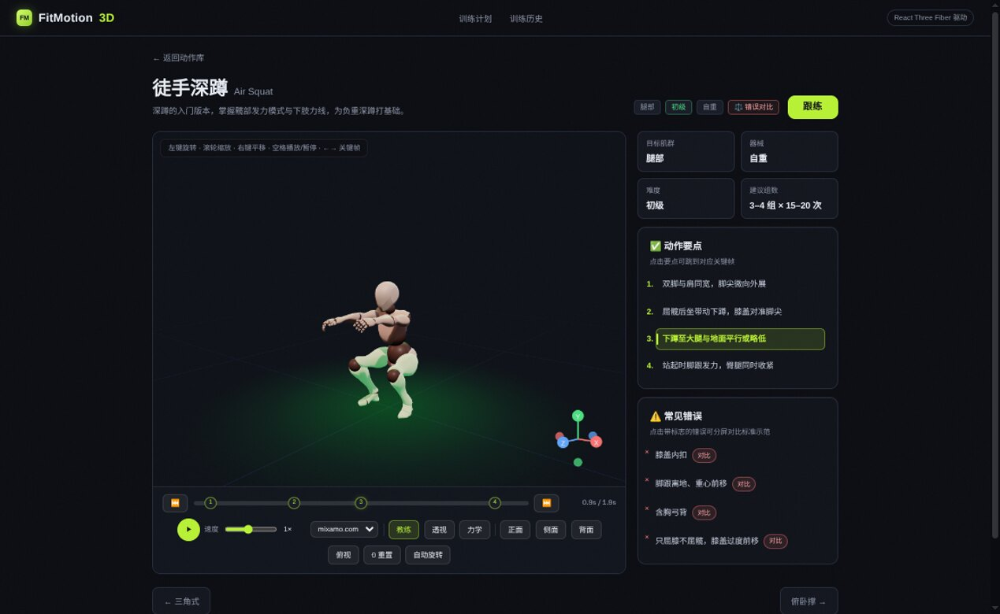</p>

### 👁 三种外观：教练 / 透视 / 力学

| 教练 | 透视 | 力学 |
| :-: | :-: | :-: |
| 不透明人偶，目标肌群高亮呼吸 | 身体半透明，露出骨骼胶囊 | 实时标注肘、髋、膝等关节角度 |

<p align="center">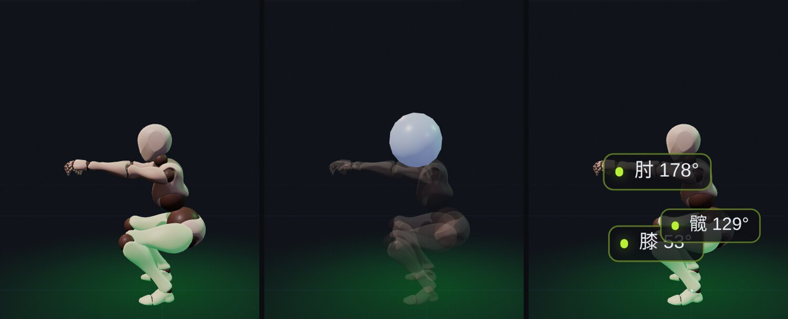</p>

### ⚖️ 错误对比：标准动作 vs 常见错误

点击「常见错误」里带 **对比** 标志的条目，进入左右分屏：左边是标准示范，右边是错误动作（如深蹲膝盖内扣、脚跟离地、含胸弓背）。两边同步播放，可各自旋转视角，建议转到同一侧面、0.5× 慢放观看。

<p align="center">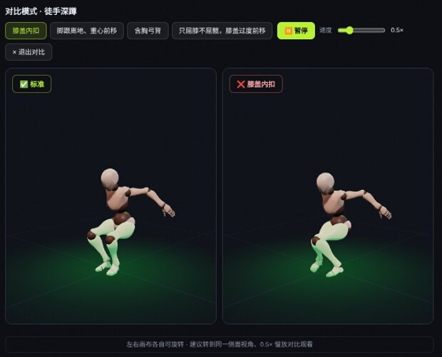</p>

### 🏃 跟练模式：自动计次、组间休息、语音教练

- 次数类动作随动画节奏**自动计次**，静态动作（平板支撑、瑜伽体式）**倒计时**
- 组间休息倒计时，可跳过；节奏 0.5× / 0.75× / 1× 可调
- **语音教练**（浏览器语音合成）播报组数、要点与鼓励，配合提示音；都可单独静音
- 完成后自动写入本地训练日志

<p align="center">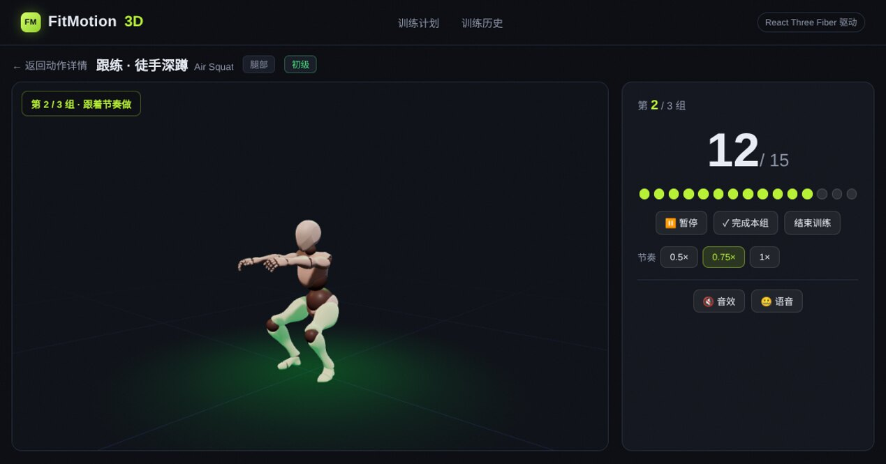</p>

### 📋 训练计划 & 📅 训练历史

- **训练计划**：推力日、拉力日、腿部日、居家全身、核心专攻 5 套模板，按顺序逐个动作跟练
- **训练历史**：每次跟练自动记录，展示近 7 天训练天数、组数、最常练动作，以及 12 周训练热力图。数据只保存在浏览器本地（localStorage），不上传任何服务器

<p align="center"></p>

### 📱 PWA 离线可用

可「添加到主屏幕」像 App 一样打开。页面和封面预缓存，3D 模型首次加载后进入缓存，之后离线也能看。

---

## 🏋️ 动作一览

5 个动作使用 Mixamo 真实动作捕捉，其余按标准关节角度用关键帧生成（卡片上标注「生成演示」）。

### 力量 · 有氧 · 核心

<table>
  <tr>
    <td align="center">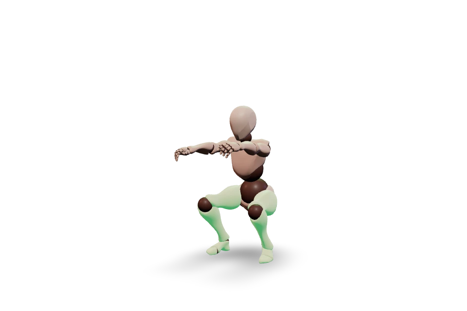<br/><b>徒手深蹲</b><br/><sub>Air Squat · 动捕</sub></td>
    <td align="center">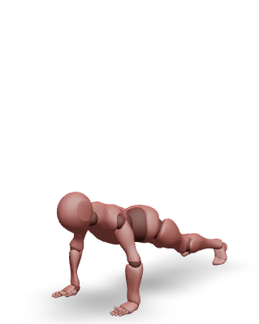<br/><b>俯卧撑</b><br/><sub>Push-Up · 动捕</sub></td>
    <td align="center">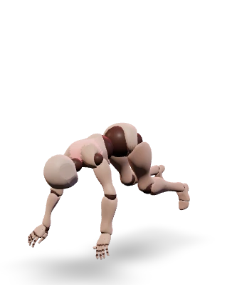<br/><b>跳跃俯卧撑</b><br/><sub>Jump Push-Up · 动捕</sub></td>
    <td align="center">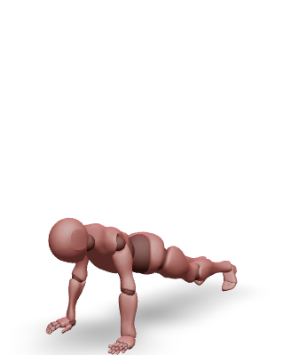<br/><b>平板支撑</b><br/><sub>Plank · 动捕</sub></td>
  </tr>
  <tr>
    <td align="center">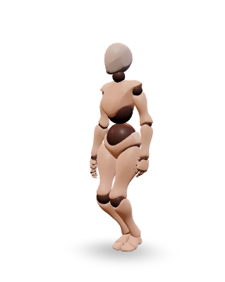<br/><b>开合跳</b><br/><sub>Jumping Jack · 动捕</sub></td>
    <td align="center">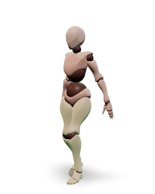<br/><b>弓步蹲</b><br/><sub>Lunge</sub></td>
    <td align="center">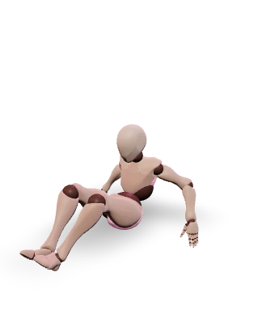<br/><b>仰卧起坐</b><br/><sub>Sit-Up</sub></td>
    <td align="center">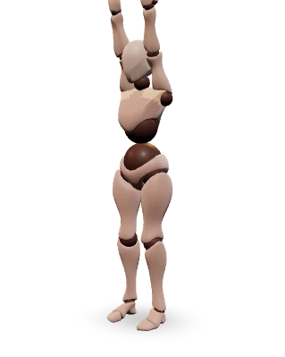<br/><b>站姿肩推</b><br/><sub>Overhead Press</sub></td>
  </tr>
  <tr>
    <td align="center">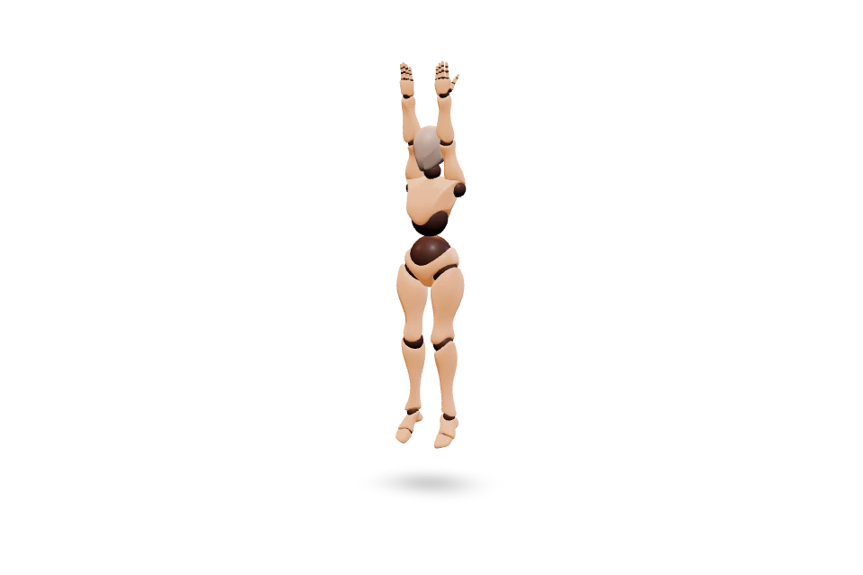<br/><b>波比跳</b><br/><sub>Burpee</sub></td>
    <td align="center">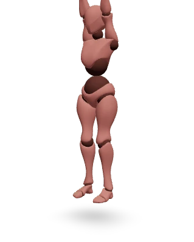<br/><b>跳跃深蹲</b><br/><sub>Jump Squat</sub></td>
    <td align="center">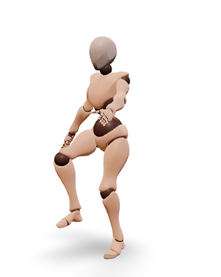<br/><b>高抬腿</b><br/><sub>High Knees</sub></td>
    <td align="center">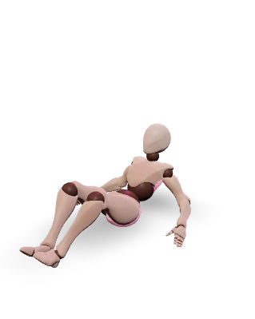<br/><b>卷腹</b><br/><sub>Crunch</sub></td>
  </tr>
  <tr>
    <td align="center">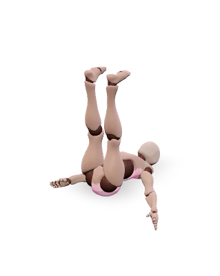<br/><b>仰卧举腿</b><br/><sub>Lying Leg Raise</sub></td>
    <td align="center">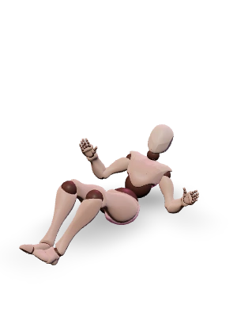<br/><b>俄罗斯转体</b><br/><sub>Russian Twist</sub></td>
    <td align="center">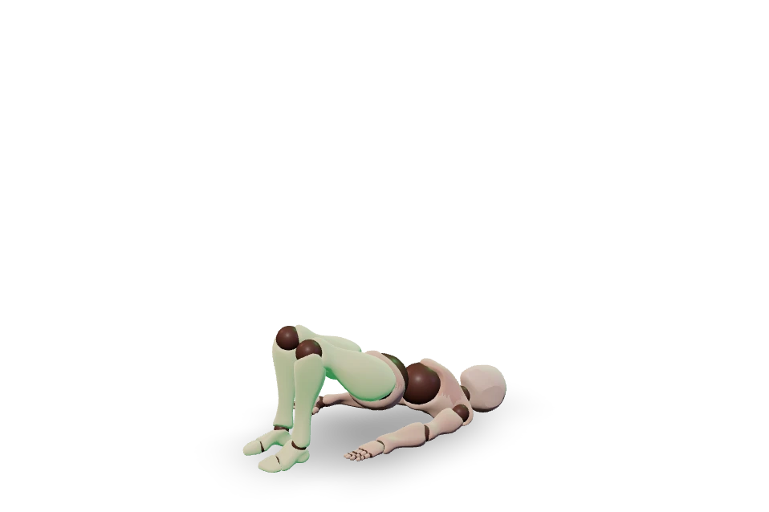<br/><b>臀桥</b><br/><sub>Glute Bridge</sub></td>
    <td align="center">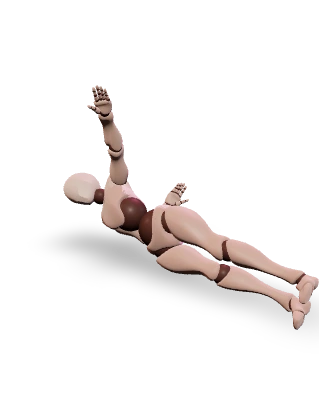<br/><b>侧平板支撑</b><br/><sub>Side Plank</sub></td>
  </tr>
  <tr>
    <td align="center">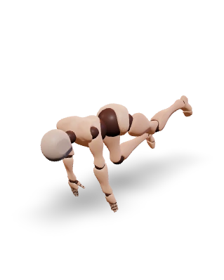<br/><b>登山跑</b><br/><sub>Mountain Climber</sub></td>
    <td align="center">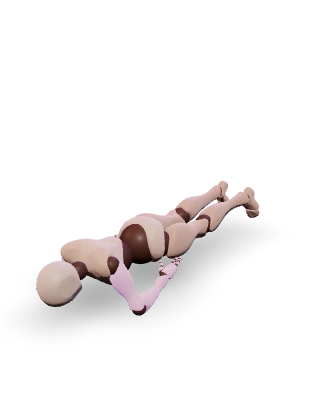<br/><b>钻石俯卧撑</b><br/><sub>Diamond Push-Up</sub></td>
    <td align="center">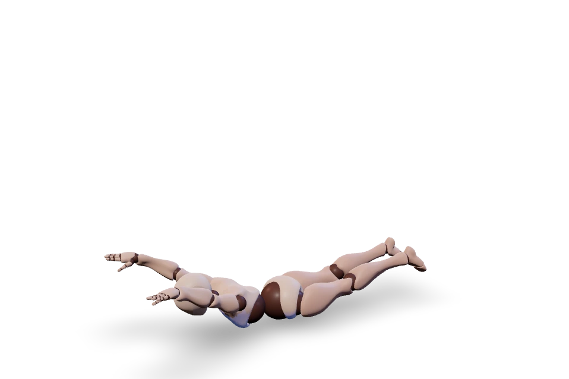<br/><b>超人式</b><br/><sub>Superman</sub></td>
    <td align="center">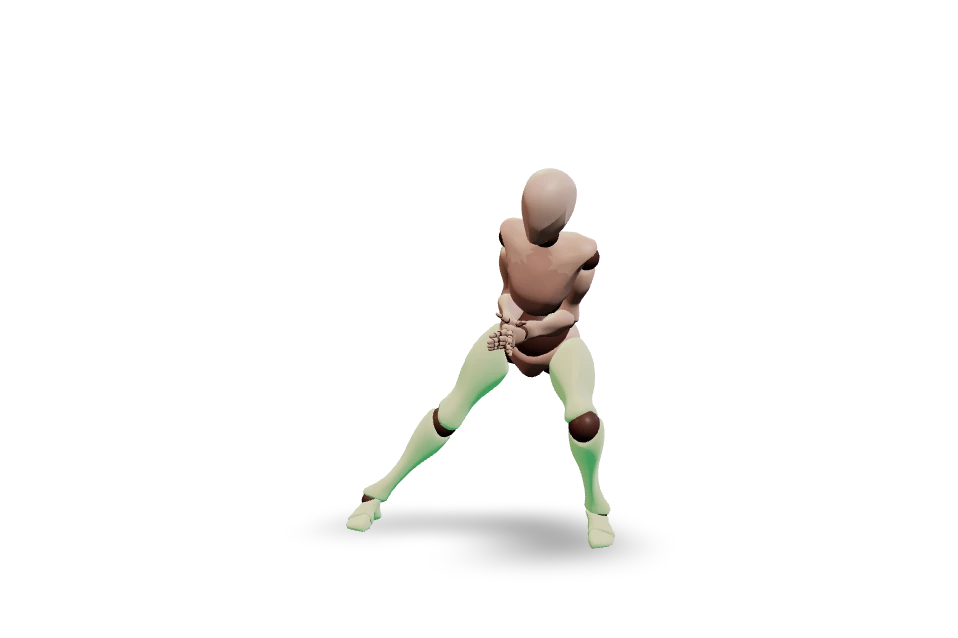<br/><b>侧弓步</b><br/><sub>Side Lunge</sub></td>
  </tr>
</table>

### 🧘 瑜伽

<table>
  <tr>
    <td align="center">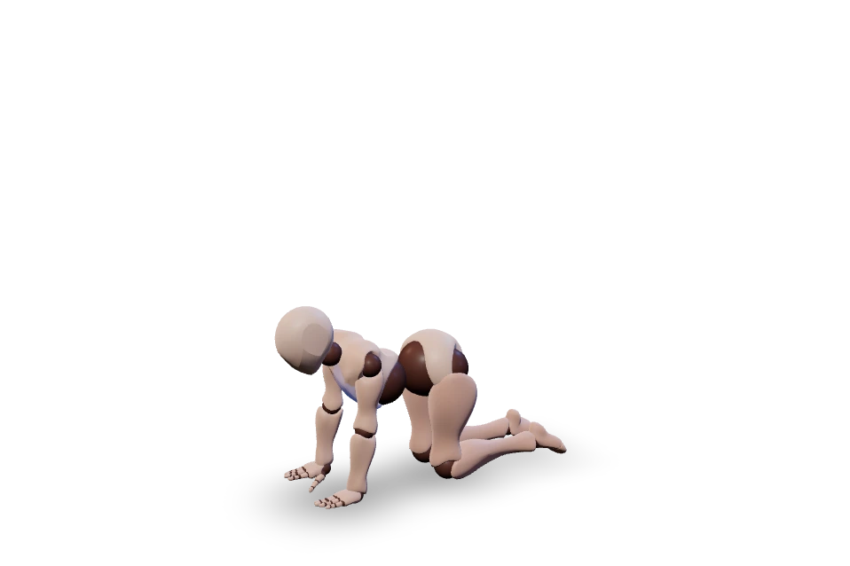<br/><b>猫牛式</b><br/><sub>Cat-Cow</sub></td>
    <td align="center">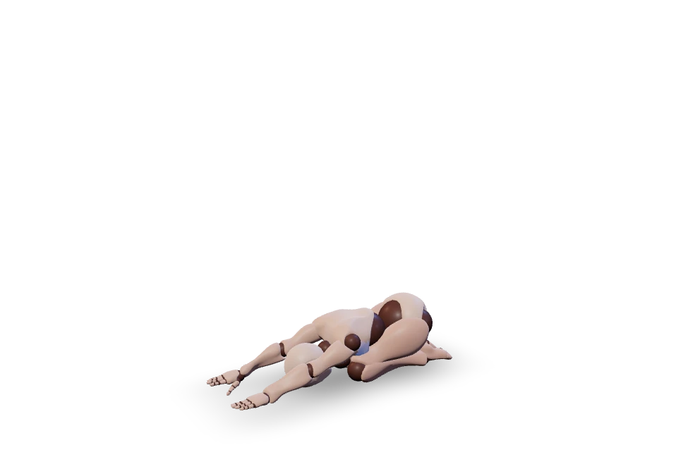<br/><b>婴儿式</b><br/><sub>Child's Pose</sub></td>
    <td align="center">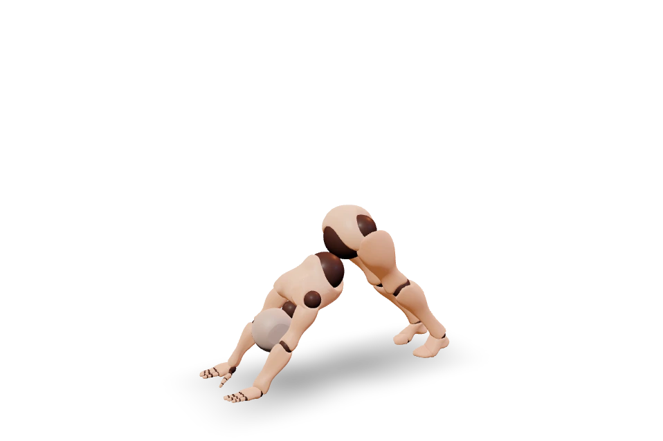<br/><b>下犬式</b><br/><sub>Downward-Facing Dog</sub></td>
  </tr>
  <tr>
    <td align="center">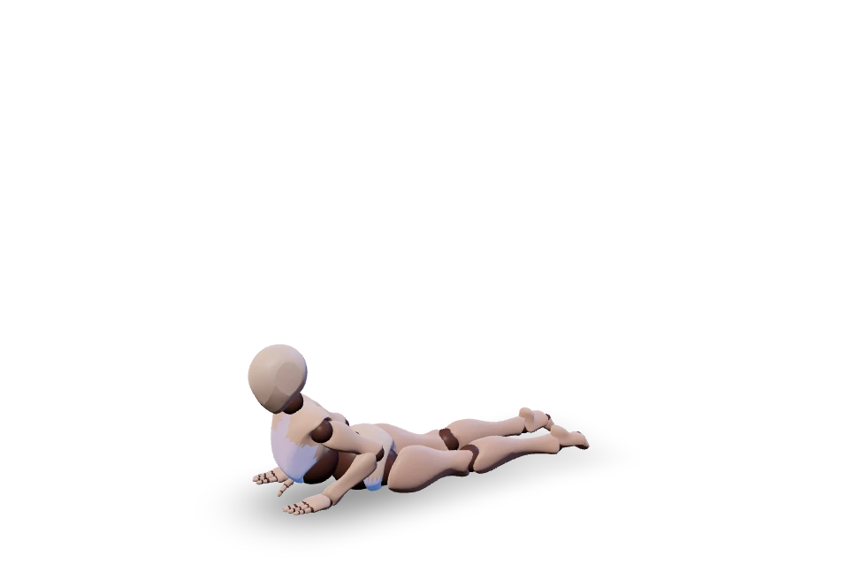<br/><b>眼镜蛇式</b><br/><sub>Cobra Pose</sub></td>
    <td align="center">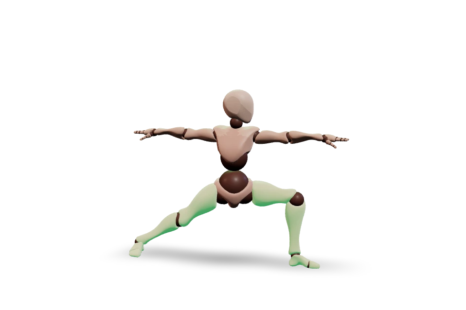<br/><b>战士二式</b><br/><sub>Warrior II</sub></td>
    <td align="center">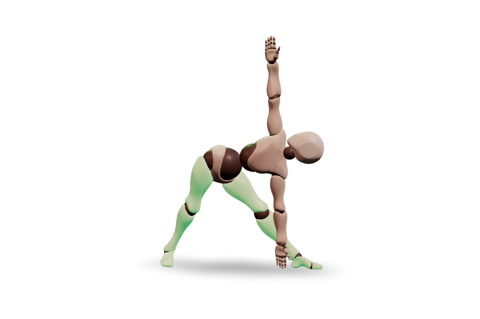<br/><b>三角式</b><br/><sub>Triangle Pose</sub></td>
  </tr>
</table>

---

## 🚀 快速开始

需要 Node.js 18 及以上（CI 使用 Node 22）。

```bash
# 安装依赖
npm install

# 启动开发服务器 → http://localhost:5173
npm run dev

# 类型检查 + 生产构建，输出到 dist/
npm run build

# 本地预览构建产物
npm run preview
```

---

## 🧱 技术栈

| 方向 | 选型 |
| --- | --- |
| 框架 | React 18 + TypeScript + Vite 5 |
| 3D 渲染 | three.js、@react-three/fiber、@react-three/drei |
| 角色与动作 | Mixamo X Bot 骨骼；FBX 动作捕捉 + 程序化关键帧动画 |
| 路由 | react-router v6 |
| 动效与滚动 | framer-motion、lenis 平滑滚动 |
| 离线 | vite-plugin-pwa（Workbox） |
| 语音 | Web Speech API（speechSynthesis）+ Web Audio 提示音 |
| 部署 | GitHub Actions → GitHub Pages |

---

## 📁 项目结构

```text
fitness-3D/
├── public/
│   ├── models/            # X Bot 角色（GLB）与 Mixamo 动捕（FBX）
│   ├── posters/           # 动作卡片封面（/poster-studio 生成）
│   └── icons/             # PWA 图标
├── src/
│   ├── data/
│   │   ├── exercises.ts   # 动作库：名称、要点、常见错误、关键帧、组数、模型
│   │   └── plans.ts       # 训练计划模板
│   ├── motion/
│   │   ├── motions.ts     # 生成动作的关节角度关键帧
│   │   ├── faults.ts      # 常见错误的变体动作（用于错误对比）
│   │   └── buildClip.ts   # 把关键帧烘焙成 three.js AnimationClip
│   ├── components/
│   │   ├── ModelViewer.tsx    # 3D 查看器：视角、时间轴、外观模式
│   │   ├── CompareView.tsx    # 标准 / 错误分屏对比
│   │   ├── FollowAlong.tsx    # 跟练状态机：开始 → 组 → 休息 → 完成
│   │   ├── CharacterModel.tsx # 角色加载、动画播放、肌群高亮
│   │   └── CardThumb3D.tsx    # 卡片悬停实时 3D
│   ├── lib/
│   │   ├── posterFrame.ts # 封面统一取景（焦距、基线、机位）
│   │   ├── coach.ts       # 语音教练
│   │   └── storage.ts     # 本地训练日志
│   └── pages/             # 动作库 / 详情 / 跟练 / 计划 / 历史 / 封面工作室
└── .github/workflows/pages.yml  # 自动部署
```

### 页面路由

| 路径 | 页面 |
| --- | --- |
| `/` | 首页 + 动作库 + 训练计划 |
| `/exercise/:id` | 动作详情（3D 查看器、要点、错误对比） |
| `/train/:id` | 单个动作跟练 |
| `/plan/:id` | 整套训练计划跟练 |
| `/history` | 训练历史与热力图 |
| `/poster-studio` | 开发工具：批量生成卡片封面（仅 dev） |

---

## 🛠 添加 / 替换动作

### 方式一：使用 Mixamo 动作捕捉

1. 打开 [mixamo.com](https://www.mixamo.com/)，用 Adobe 账号免费登录，角色推荐 **X Bot / Y Bot**
2. 搜索动作英文名（如 Squat、Push Up、Burpee），预览满意后点 Download
3. 格式选 **FBX Binary**，勾选 **With Skin**，下载后放进 `public/models/`
4. 在 `src/data/exercises.ts` 中把对应动作的 `model.url` 改成新文件名，并把 `placeholder` 设为 `false`

> 💡 查看器同时支持 GLB / FBX。想让文件更小，可以用 Blender 打开 FBX 再导出为 GLB（glTF Binary）。

### 方式二：用关键帧生成动作

在 `src/motion/motions.ts` 里按关节欧拉角写关键帧，然后在 `exercises.ts` 中引用：

```ts
{
  id: 'downward-dog',
  name: '下犬式',
  nameEn: 'Downward-Facing Dog',
  muscle: '全身',
  style: '瑜伽',
  keyPoints: ['从四点跪开始…', '坐骨向上向后推…', /* … */],
  mistakes: ['弓背含胸，背部没有伸长', /* … */],
  keyframes: [{ at: 0.15, point: 1 }, { at: 0.45, point: 2 }], // 要点 → 动画进度
  program: { sets: 3, seconds: 30, restSeconds: 20 },         // 跟练：组数、计时、休息
  model: { url: '/models/Xbot.glb', clip: 'downward-dog' },   // clip 对应 motions.ts 里的动作
  generated: true,
  posterAt: 0.5,                                              // 封面取第几帧（0~1）
}
```

常见错误的对比动画写在 `src/motion/faults.ts`，作为标准动作的变体。

### 重新生成封面

封面是静态图片，改了动作之后要重新渲染：

1. `npm run dev`，打开 <http://localhost:5173/poster-studio>
2. 点「生成全部」，封面会直接写入 `public/posters/`
3. 只重做部分动作：`/poster-studio?only=瑜伽` 或 `/poster-studio?only=cobra,lunge`

取景是统一的，大多数动作不需要调。个别动作想换个角度，可以在 `exercises.ts` 里设置：

- `posterAt`：取动画的哪一刻（0~1），选最有代表性的姿势
- `posterView`：`{ azimuth, elevation }`，覆盖默认的机位方位角 / 俯仰角

---

## 🌐 部署

推送到 `master` 分支后，`.github/workflows/pages.yml` 会自动执行 `npm ci && npm run build`，把 `dist/` 发布到 GitHub Pages。

- 生产构建的 `base` 是 `/fitness-3D/`（见 `vite.config.ts`），fork 后仓库名不同的话需要同步修改
- GitHub Pages 没有 SPA 回退：构建时会把 `index.html` 复制成 `404.html`，刷新 `/exercise/...` 等子路由也能正常打开
- 首次使用需要在仓库 **Settings → Pages** 里把 Source 设为 **GitHub Actions**

---

## 📝 说明

- 3D 角色来自 [Mixamo](https://www.mixamo.com/)，请遵守其使用条款
- 动作要点仅供参考，有伤病或特殊情况请咨询专业教练或医生
